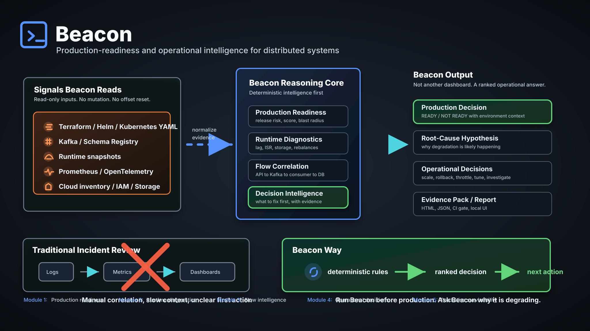
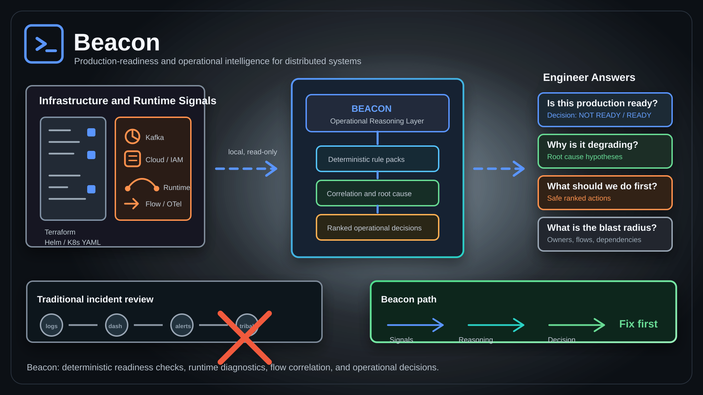

# Beacon

Local production-readiness checks for distributed systems.

Beacon scans infrastructure/configuration inputs and reports release risks
before deployment. The first question is practical:

```text
Is this system production ready?
```

New here? Start with the
[`5-minute quickstart`](QUICKSTART_5_MINUTES.md).

Current stable focus:

- static production-readiness scans
- Kafka, Kubernetes, Terraform, cloud/IAM/storage, Helm-rendered manifests, and
  CI/CD checks
- JSON and HTML reports
- inspectable readiness packs
- local Docker/CLI/UI usage

Experimental areas:

- Kafka runtime diagnostics
- flow and deployment correlation
- ranked operational decisions

Beacon is read-only. It does not mutate infrastructure, consume Kafka messages,
alter Kafka topics, update consumer offsets, or change Kubernetes resources.
Known limitations are documented in [`docs/LIMITATIONS.md`](docs/LIMITATIONS.md).

## Example Output

Beacon output is intended to be explicit about what it knows and what it cannot
prove yet:

```text
Decision: NOT READY
Score: 42/100

Top risks:
- HIGH: Kafka topic has replication factor 1
- HIGH: Kubernetes workload is missing readiness/liveness probes
- MEDIUM: Terraform plan contains unknown-after-apply endpoint values

Recommended action:
- Fix critical/high release blockers before production rollout.
- Re-run after apply with Terraform state or live snapshots for stronger
  dependency correlation.
```

## What Beacon Does

Beacon currently has these supported surfaces:

| Area | Status | Notes |
| --- | --- | --- |
| Production readiness scan | Stable/RC | Main supported path |
| Kafka static readiness | Stable/RC | Topics, brokers, producers, consumers, ACLs, Schema Registry examples |
| Kubernetes manifest readiness | Stable/RC | Probes, resources, PDBs, security context, admission/RBAC patterns |
| Terraform/cloud readiness | Stable/RC | HCL, plan/state JSON, cloud inventory, IAM, storage, database/network posture |
| IaC coverage | Preview | Compares inventory exports with Terraform state and ownership metadata |
| Runtime diagnostics | Experimental | Kafka-first snapshots and live/read-only inputs |
| Flow correlation | Experimental | API -> Kafka -> consumer -> database style snapshot correlation |

Beacon can evaluate:

- Kafka topics, brokers, producers, consumers, ACL exports, Schema Registry, and runtime history
- Kubernetes manifests and runtime snapshots
- Terraform HCL, plan JSON, and state JSON
- Helm charts through rendered manifests
- Cloud inventory, object storage, IAM, and CI/CD workflow risk
- API, database, storage, and platform runtime snapshots
- Prometheus collector configs and OpenTelemetry exports
- Cross-system flow degradation and deployment-triggered regression signals

## Architecture At A Glance



Beacon normalizes inputs into resources, runs registered rules, groups findings,
scores readiness, and produces reports. Rules and packs are inspectable.

## Operational Reasoning Flow



Beacon is designed to connect scattered infrastructure signals into one
readiness answer: what is risky, why it matters, what evidence supports it, and
what engineers should inspect or fix first.

High-impact readiness use cases now covered include:

- **Can Kubernetes survive node maintenance?** Beacon flags workloads whose PodDisruptionBudget is missing or configured so loosely that all replicas can be disrupted.
- **Can the service scale during a traffic spike?** Beacon flags HorizontalPodAutoscalers with `maxReplicas` at or below the current replica target.
- **Can the cluster enforce workload security at admission time?** Beacon flags namespaces without Pod Security admission, permissive admission webhooks, risky cluster-admin bindings, wildcard RBAC, and inline Kubernetes Secrets.
- **Can Kafka clients and brokers enforce safe transport/auth posture?** Beacon flags plaintext Kafka clients, SASL without TLS, SASL/PLAIN usage, disabled TLS hostname verification, missing authorizers, and broad ACL fallback behavior.
- **Can the database recover from accidental deletion or corruption?** Beacon flags RDS instances missing backup retention or deletion protection.
- **Can cloud identity and database controls survive compromise scenarios?** Beacon flags broad AWS managed admin policy attachments and unencrypted RDS storage.
- **Can object storage recover from overwrite/delete mistakes?** Beacon flags buckets with neither versioning nor lifecycle controls.
- **Can Terraform plan/state changes safely go to production?** Beacon scans HCL, plan JSON, and state JSON for infrastructure survivability risks before rollout.
- **What should engineers fix first?** Beacon turns grouped findings into ranked operational decisions with target domain, confidence, evidence, safety, and "do not do" guidance.

Additional readiness capability:

- **What cloud resources exist outside Terraform state?** Beacon compares cloud inventory exports, Terraform state, ownership metadata, and optional activity/cost context to detect unmanaged resources, classify risk, and recommend whether to import, delete, tag, quarantine, or review. See [`docs/IAC_COVERAGE_READINESS.md`](docs/IAC_COVERAGE_READINESS.md).
- **Can Beacon use inventory exports I already have?** Yes. IaC coverage accepts Beacon `resources`, AWS Config `configurationItems`, AWS Resource Explorer `Resources`, and Steampipe/CloudQuery `rows` as file inputs.

## Inspectable Readiness Packs

Beacon is not meant to replace OPA, Sentinel, admission controllers, or
policy-as-code guardrails. Those tools are the right layer for hard allow/deny
enforcement.

Beacon adds a release-readiness layer on top:

```text
OPA/Sentinel enforce individual policies.
Beacon explains release readiness across many operational signals.
```

For the longer explanation, see
[`docs/BEACON_VS_OPA_SENTINEL.md`](docs/BEACON_VS_OPA_SENTINEL.md).

To keep that transparent, Beacon includes inspectable readiness packs. A pack is
a visible grouping of rule IDs, intent, use cases, and non-goals. Beacon remains
the runner, normalizer, scorer, reporter, and UI.

```bash
python3 -m beacon.cli packs list
python3 -m beacon.cli packs show kafka-production-readiness
python3 -m beacon.cli packs rules kafka-production-readiness
python3 -m beacon.cli packs show kubernetes-production-readiness
python3 -m beacon.cli packs rules kubernetes-production-readiness
python3 -m beacon.cli packs show cloud-production-readiness
python3 -m beacon.cli packs rules cloud-production-readiness
python3 -m beacon.cli packs show cloud-azure-readiness
python3 -m beacon.cli packs rules cloud-azure-readiness
python3 -m beacon.cli packs show cloud-gcp-readiness
python3 -m beacon.cli packs rules cloud-gcp-readiness
python3 -m beacon.cli packs show terraform-aws-readiness
python3 -m beacon.cli packs rules terraform-aws-readiness
python3 -m beacon.cli packs show iac-coverage-readiness
python3 -m beacon.cli packs rules iac-coverage-readiness
python3 -m beacon.cli packs show distributed-system-production-readiness
python3 -m beacon.cli packs rules distributed-system-production-readiness
```

See [`packs/`](packs/) for the current Kafka, Kubernetes, cloud, Azure, GCP,
provider-specific Terraform/AWS, IaC coverage, and distributed-system readiness
packs.

## Custom Policy Overrides

You can customize Beacon's interpretation of existing rules with a policy file.
This is useful for environment-specific exceptions, temporary waivers, and
severity overrides.

Example:

```yaml
policy:
  rules:
    kafka.topic.owner.missing:
      severity: LOW
  waivers:
    - rule_id: kafka.topic.partitions.low
      resource: checkout.retry
      reason: Dev retry topic preserves ordering and is intentionally single-partitioned.
      expires: 2026-12-31
      severity: INFO
```

Beacon can load policy from:

```bash
BEACON_POLICY_FILE=./beacon-policy.yaml beacon readiness
```

or from the default local path:

```text
~/.beacon/policy.yaml
```

See [`beacon/policy.py`](beacon/policy.py) and
[`examples/product-readiness/dev-exception/beacon-policy.yaml`](examples/product-readiness/dev-exception/beacon-policy.yaml)
for the current policy injection model.

Current boundary: readiness packs are inspectable, and policy files can disable
existing rules, change severity, or add visible waivers. New custom rule
execution is still defined internally by Beacon's registered rule system.

## Fastest Way To Try Beacon

The recommended distribution path is Docker. You do not need Python, source
code, or a macOS installer.

Pull the image:

```bash
docker pull ghcr.io/mishraricha1806/beacon:latest
```

`latest` is convenient for trying Beacon quickly. For safer and reproducible
internal usage, pin the image by digest because tags can move:

```bash
docker buildx imagetools inspect ghcr.io/mishraricha1806/beacon:latest

docker run --rm \
  ghcr.io/mishraricha1806/beacon@sha256:<digest> --help
```

Run the UI:

```bash
docker run --rm -p 8765:8765 ghcr.io/mishraricha1806/beacon:latest ui --host 0.0.0.0 --port 8765
```

Open:

```text
http://127.0.0.1:8765/
```

Use `0.0.0.0` only in the Docker command. In the browser, use
`127.0.0.1` or `localhost`.

If port `8765` is busy:

```bash
docker run --rm -p 8777:8765 ghcr.io/mishraricha1806/beacon:latest ui --host 0.0.0.0 --port 8765
```

Then open:

```text
http://127.0.0.1:8777/
```

## How Docker Examples Work

The published Beacon image contains the Beacon binary and a safe example set
under `/workspace/examples`. You can try Beacon without cloning the source repo:

```bash
docker run --rm \
  ghcr.io/mishraricha1806/beacon:latest readiness static \
  /workspace/examples/bad-infra \
  --environment prod \
  --no-html \
  --no-open-report
```

When scanning your own project, mount it separately:

```bash
docker run --rm \
  -v "$PWD:/workspace/project:ro" \
  ghcr.io/mishraricha1806/beacon:latest readiness static \
  /workspace/project \
  --environment prod \
  --no-html \
  --no-open-report
```

All built-in example commands below use `/workspace/examples/...`. If your
examples live somewhere else, mount that folder explicitly:

```bash
docker run --rm \
  -v "/absolute/path/to/beacon/examples:/workspace/examples:ro" \
  ghcr.io/mishraricha1806/beacon:latest readiness static \
  /workspace/examples/bad-infra \
  --environment prod \
  --no-html \
  --no-open-report
```

If Beacon reports a missing path, it means the path you passed does not exist
inside the container:

```text
Path does not exist: /workspace/examples/...
```

## Use Case 0: IaC Coverage Readiness

Question:

```text
What cloud resources exist outside Terraform state?
```

What Beacon checks:

- cloud resources present in inventory but missing from Terraform state
- missing owner/application metadata
- recent cost or activity on unmanaged resources
- public exposure on unmanaged resources
- sensitive unmanaged databases, search clusters, storage, or platform resources
- recommended disposition: import, delete after validation, tag, quarantine, or review

CLI test:

```bash
docker run --rm \
  -v "$PWD:/workspace/project:ro" \
  ghcr.io/mishraricha1806/beacon:latest readiness iac-coverage \
  --cloud-inventory /workspace/examples/iac-coverage/aws-inventory.json \
  --terraform-state /workspace/examples/iac-coverage/terraform-state.json \
  --owners /workspace/examples/iac-coverage/owners.yaml \
  --environment prod \
  --no-html \
  --no-open-report
```

For larger organizations with many Terraform states, use a state directory or
manifest so Beacon builds one managed-resource index before comparing cloud
inventory:

```bash
docker run --rm \
  -v "$PWD:/workspace/project:ro" \
  ghcr.io/mishraricha1806/beacon:latest readiness iac-coverage \
  --cloud-inventory /workspace/project/exports/aws-config-prod.json \
  --terraform-state-dir /workspace/project/exports/terraform-states \
  --owners /workspace/project/exports/owners.yaml \
  --environment prod \
  --no-html \
  --no-open-report
```

Manifest mode is also supported:

```bash
docker run --rm \
  -v "$PWD:/workspace/project:ro" \
  ghcr.io/mishraricha1806/beacon:latest readiness iac-coverage \
  --cloud-inventory /workspace/project/exports/aws-config-prod.json \
  --state-manifest /workspace/project/exports/terraform-workspaces.yaml \
  --environment prod \
  --no-html \
  --no-open-report
```

## Use Case 1: Bad Infra Readiness Gate

Question:

```text
Would this infrastructure be unsafe if released to production?
```

What Beacon checks:

- Kafka replication factor and partition safety
- Kafka retention and message-size risk
- Terraform/storage/IAM production-readiness issues
- Grouped root-cause risks and next actions

### UI Test

1. Start the UI:

   ```bash
   docker run --rm -p 8765:8765 ghcr.io/mishraricha1806/beacon:latest ui --host 0.0.0.0 --port 8765
   ```

2. Open:

   ```text
   http://127.0.0.1:8765/
   ```

3. Choose the static/readiness input.
4. Upload files from:

   ```text
   examples/bad-infra/
   ```

5. Run the scan and review the readiness score, top reasons, grouped risks,
   and next actions.

### CLI Test

```bash
docker run --rm \
  -v "$PWD:/workspace/project:ro" \
  ghcr.io/mishraricha1806/beacon:latest readiness static \
  /workspace/examples/bad-infra \
  --environment prod \
  --no-html \
  --no-open-report
```

JSON output:

```bash
docker run --rm \
  -v "$PWD:/workspace/project:ro" \
  ghcr.io/mishraricha1806/beacon:latest readiness static \
  /workspace/examples/bad-infra \
  --environment prod \
  --output json \
  --no-html \
  --no-open-report
```

Expected type of result:

```text
Decision: NOT READY
Top risks: replication, storage/message size, missing owner/governance context
```

## Use Case 2: Black Friday Readiness

Question:

```text
Can this payment/event pipeline survive a peak-traffic launch?
```

What Beacon checks:

- Kafka broker failure survivability
- payment-topic replication and ISR posture
- producer durability and idempotence
- consumer concurrency and retry/DLQ safety
- runtime pressure across API, Kafka, consumer, database, and storage
- whether the likely bottleneck is Kafka, consumers, storage, or downstream DB/API

### UI Test

1. Start the UI:

   ```bash
   docker run --rm -p 8765:8765 ghcr.io/mishraricha1806/beacon:latest ui --host 0.0.0.0 --port 8765
   ```

2. Open:

   ```text
   http://127.0.0.1:8765/
   ```

3. Upload static input:

   ```text
   examples/demo-black-friday/kafka-config.yaml
   ```

4. Upload runtime snapshot:

   ```text
   examples/demo-black-friday/runtime-snapshot.yaml
   ```

5. Run the report and review the top risks and root-cause hypotheses.

### CLI Static Readiness

```bash
docker run --rm \
  -v "$PWD:/workspace/project:ro" \
  ghcr.io/mishraricha1806/beacon:latest readiness static \
  /workspace/examples/demo-black-friday \
  --environment prod \
  --no-html \
  --no-open-report
```

### Runtime Snapshot Diagnosis

```bash
docker run --rm \
  -v "$PWD:/workspace/project:ro" \
  ghcr.io/mishraricha1806/beacon:latest diagnose snapshot \
  /workspace/examples/demo-black-friday/runtime-snapshot.yaml \
  --no-html \
  --no-open-report
```

### Combined Readiness

```bash
docker run --rm \
  -v "$PWD:/workspace/project:ro" \
  ghcr.io/mishraricha1806/beacon:latest readiness all \
  --static-path /workspace/examples/demo-black-friday \
  --snapshot /workspace/examples/demo-black-friday/runtime-snapshot.yaml \
  --environment prod \
  --no-html \
  --no-open-report
```

Expected type of result:

```text
Decision: NOT READY or CONDITIONAL depending on risk profile
Top risks: replication, producer durability, retention/storage growth, DB/API pressure
```

## Use Case 3: Kafka Runtime Diagnostics

Question:

```text
Why is Kafka or a consumer flow degrading right now?
```

Beacon can work with offline runtime snapshots or direct read-only Kafka
connections.

### UI Test With Snapshot

1. Start the UI:

   ```bash
   docker run --rm -p 8765:8765 ghcr.io/mishraricha1806/beacon:latest ui --host 0.0.0.0 --port 8765
   ```

2. Open:

   ```text
   http://127.0.0.1:8765/
   ```

3. Upload one of:

   ```text
   examples/runtime/kafka-runtime.yaml
   examples/supported/kafka/runtime-v2.yaml
   examples/supported/kafka/scenarios/rebalance-storm-runtime.yaml
   examples/supported/kafka/scenarios/quota-throttle-runtime.yaml
   examples/supported/kafka/scenarios/schema-poison-runtime.yaml
   ```

4. Run diagnostics and review likely cause, evidence, and first actions.

### CLI Kafka Runtime Snapshot

```bash
docker run --rm \
  -v "$PWD:/workspace/project:ro" \
  ghcr.io/mishraricha1806/beacon:latest diagnose kafka-runtime \
  /workspace/examples/runtime/kafka-runtime.yaml \
  --no-html \
  --no-open-report
```

### CLI Platform Runtime Snapshot

```bash
docker run --rm \
  -v "$PWD:/workspace/project:ro" \
  ghcr.io/mishraricha1806/beacon:latest diagnose snapshot \
  /workspace/examples/supported/runtime/platform-runtime.yaml \
  --no-html \
  --no-open-report
```

### CLI Flow Runtime Diagnosis

```bash
docker run --rm \
  -v "$PWD:/workspace/project:ro" \
  ghcr.io/mishraricha1806/beacon:latest diagnose flow \
  /workspace/examples/supported/runtime/flow-runtime.yaml \
  --no-html \
  --no-open-report
```

### Direct Live Kafka Read-Only Diagnosis

Plaintext local Kafka:

```bash
docker run --rm \
  ghcr.io/mishraricha1806/beacon:latest diagnose kafka \
  --bootstrap-server host.docker.internal:9092 \
  --security-protocol PLAINTEXT \
  --max-topics 50 \
  --max-groups 20 \
  --request-timeout-ms 30000 \
  --no-html \
  --no-open-report
```

SSL/mTLS Kafka with mounted certificates:

```bash
docker run --rm \
  -v "$PWD:/workspace/project:ro" \
  ghcr.io/mishraricha1806/beacon:latest diagnose kafka \
  --bootstrap-server "broker1:9093,broker2:9093,broker3:9093" \
  --security-protocol SSL \
  --ca-cert /workspace/project/certs/ca.pem \
  --client-cert /workspace/project/certs/client.pem \
  --client-key /workspace/project/certs/client.key \
  --topic payments \
  --consumer-group payment-processor \
  --max-topics 50 \
  --max-groups 20 \
  --request-timeout-ms 30000 \
  --no-html \
  --no-open-report
```

Beacon runtime diagnostics are read-only. Beacon does not produce messages,
consume messages, mutate topics, delete topics, change ACLs, or update offsets.

## Use Case 4: Supported All-Domain Readiness

Question:

```text
Can Beacon combine multiple infrastructure and runtime domains into one release decision?
```

This example covers Kafka, Kubernetes, Terraform, Helm, cloud inventory, CI/CD,
topology, runtime snapshots, OpenTelemetry, Prometheus, Schema Registry, and
flow intelligence.

Some collector-style example configs use placeholder endpoints such as
`schema-registry.local` or `localhost:9090`. If those services are not running,
Beacon will return explicit analysis-blocked findings. That is expected: it
shows how Beacon handles unreachable read-only collectors in a release gate.

### UI Test

1. Start the UI:

   ```bash
   docker run --rm -p 8765:8765 ghcr.io/mishraricha1806/beacon:latest ui --host 0.0.0.0 --port 8765
   ```

2. Open:

   ```text
   http://127.0.0.1:8765/
   ```

3. Use files under:

   ```text
   examples/supported/
   ```

4. Run a combined report and review distributed readiness dimensions.

### CLI Static Readiness

```bash
docker run --rm \
  -v "$PWD:/workspace/project:ro" \
  ghcr.io/mishraricha1806/beacon:latest readiness static \
  /workspace/examples/supported \
  --environment prod \
  --no-html \
  --no-open-report
```

### CLI All-Domain Readiness

```bash
docker run --rm \
  -v "$PWD:/workspace/project:ro" \
  ghcr.io/mishraricha1806/beacon:latest readiness all \
  --static-path /workspace/examples/supported \
  --snapshot /workspace/examples/supported/runtime/all-runtime.yaml \
  --deployment-events /workspace/examples/supported/deployments/events.yaml \
  --opentelemetry /workspace/examples/supported/opentelemetry/checkout-otel.yaml \
  --schema-registry /workspace/examples/supported/kafka/schema-registry.yaml \
  --environment prod \
  --no-html \
  --no-open-report
```

### CLI All-Domain Diagnostics

```bash
docker run --rm \
  -v "$PWD:/workspace/project:ro" \
  ghcr.io/mishraricha1806/beacon:latest diagnose all \
  --static-path /workspace/examples/supported \
  --snapshot /workspace/examples/supported/runtime/all-runtime.yaml \
  --deployment-events /workspace/examples/supported/deployments/events.yaml \
  --opentelemetry /workspace/examples/supported/opentelemetry/checkout-otel.yaml \
  --schema-registry /workspace/examples/supported/kafka/schema-registry.yaml \
  --no-html \
  --no-open-report
```

## Use Case 5: Individual Domain Examples

Run each supported domain independently when you want to isolate behavior.

### Kubernetes Manifest Readiness

```bash
docker run --rm \
  -v "$PWD:/workspace/project:ro" \
  ghcr.io/mishraricha1806/beacon:latest readiness static \
  /workspace/examples/supported/kubernetes \
  --environment prod \
  --no-html \
  --no-open-report
```

### Terraform, Plan, And State Readiness

```bash
docker run --rm \
  -v "$PWD:/workspace/project:ro" \
  ghcr.io/mishraricha1806/beacon:latest readiness static \
  /workspace/examples/supported/terraform \
  --environment prod \
  --no-html \
  --no-open-report
```

### Kafka ACL Export Readiness

```bash
docker run --rm \
  -v "$PWD:/workspace/project:ro" \
  ghcr.io/mishraricha1806/beacon:latest readiness kafka-acls \
  /workspace/examples/supported/kafka/acls.yaml \
  --environment prod \
  --no-html \
  --no-open-report
```

### Kafka History / Churn Readiness

```bash
docker run --rm \
  -v "$PWD:/workspace/project:ro" \
  ghcr.io/mishraricha1806/beacon:latest readiness kafka-history \
  /workspace/examples/supported/kafka/history.yaml \
  --environment prod \
  --no-html \
  --no-open-report
```

### Schema Registry Readiness

```bash
docker run --rm \
  -v "$PWD:/workspace/project:ro" \
  ghcr.io/mishraricha1806/beacon:latest readiness schema-registry \
  /workspace/examples/supported/kafka/schema-registry.yaml \
  --environment prod \
  --no-html \
  --no-open-report
```

### Prometheus-Derived Runtime Readiness

```bash
docker run --rm \
  -v "$PWD:/workspace/project:ro" \
  ghcr.io/mishraricha1806/beacon:latest readiness prometheus \
  /workspace/examples/supported/prometheus/platform-prometheus.yaml \
  --environment prod \
  --no-html \
  --no-open-report
```

### OpenTelemetry-Derived Runtime Readiness

```bash
docker run --rm \
  -v "$PWD:/workspace/project:ro" \
  ghcr.io/mishraricha1806/beacon:latest readiness opentelemetry \
  /workspace/examples/supported/opentelemetry/checkout-otel.yaml \
  --environment prod \
  --no-html \
  --no-open-report
```

### Flow Intelligence

```bash
docker run --rm \
  -v "$PWD:/workspace/project:ro" \
  ghcr.io/mishraricha1806/beacon:latest diagnose flow \
  /workspace/examples/supported/flow/scenarios/downstream-db-bottleneck.yaml \
  --no-html \
  --no-open-report
```

### Deployment-Triggered Degradation

```bash
docker run --rm \
  -v "$PWD:/workspace/project:ro" \
  ghcr.io/mishraricha1806/beacon:latest diagnose flow \
  /workspace/examples/supported/flow/scenarios/deployment-triggered-degradation.yaml \
  --no-html \
  --no-open-report
```

### Cascading Latency

```bash
docker run --rm \
  -v "$PWD:/workspace/project:ro" \
  ghcr.io/mishraricha1806/beacon:latest diagnose flow \
  /workspace/examples/supported/flow/scenarios/cascading-latency.yaml \
  --no-html \
  --no-open-report
```

## Project-Local Config

Beacon supports project-local config discovery with:

```text
beacon.yaml
beacon.yml
.beacon.yaml
```

From source or from a mounted project, you can run:

```bash
beacon init
beacon doctor
beacon readiness
beacon run prod-check
```

With Docker:

```bash
docker run --rm \
  -v "$PWD:/workspace/project:ro" \
  ghcr.io/mishraricha1806/beacon:latest readiness \
  --config /workspace/project/beacon.yaml \
  --evidence-output /workspace/project/beacon-evidence.json \
  --output terminal
```

Compare release evidence from two runs:

```bash
beacon compare beacon-evidence-before.json beacon-evidence-after.json
```

CI/CD copy-paste examples are available in
[docs/CICD_INTEGRATION.md](docs/CICD_INTEGRATION.md).

For a short product-readiness story, run:

```bash
scripts/demo_product_readiness.sh
```

It demonstrates `good infra -> READY`, `bad infra -> NOT READY`,
`dev exception -> contextual low risk`, and `same config in prod -> NOT READY`.

## Output Formats

Terminal output:

```bash
--output terminal
```

JSON output:

```bash
--output json
```

Disable browser report generation in automation:

```bash
--no-html --no-open-report
```

## Environment Profiles

Beacon can interpret findings differently by environment:

```bash
--environment dev
--environment test
--environment staging
--environment prod
```

Use `prod` for strict release gates. Use `dev` or `test` when single-broker,
low-replication, or experimental patterns are expected and should be
interpreted with lower severity.

## Safety Contract

Beacon live diagnostics are read-only.

Beacon does not:

- consume business messages
- produce messages
- alter topics
- delete topics
- mutate ACLs
- update consumer offsets
- mutate Kubernetes resources
- mutate infrastructure

Beacon only reads metadata, configuration, runtime snapshots, offsets, and
status signals.

## Public Distribution Model

Recommended setup:

```text
Private source repo:
- implementation
- tests
- build pipeline
- internal examples

Public distribution repo:
- README
- screenshots
- quick-start commands
- release notes
- safe sample inputs
- links to ghcr.io/mishraricha1806/beacon:latest
```

This lets users run Beacon quickly without receiving the source code.

## Deeper Documentation

- [Documentation Index](docs/README.md)
- [Limitations](docs/LIMITATIONS.md)
- [Architecture](docs/ARCHITECTURE.md)
- [Module 1 Release](docs/MODULE_1_RELEASE.md)
- [Module 2 Runtime Diagnostics](docs/MODULE_2_RUNTIME_DIAGNOSTICS.md)
- [Module 3 Flow Intelligence](docs/MODULE_3_FLOW_INTELLIGENCE.md)
- [Project Local Config](docs/PROJECT_LOCAL_CONFIG.md)
- [Kafka Release](docs/KAFKA_RELEASE.md)
- [IaC Coverage Readiness](docs/IAC_COVERAGE_READINESS.md)
- [Beacon vs OPA/Sentinel](docs/BEACON_VS_OPA_SENTINEL.md)

## Product Philosophy

Beacon is not an observability backend. It does not store logs or metrics.

The goal is a local, inspectable readiness report:

```text
What is unsafe?
Why does it matter?
What should engineers fix first?
```
